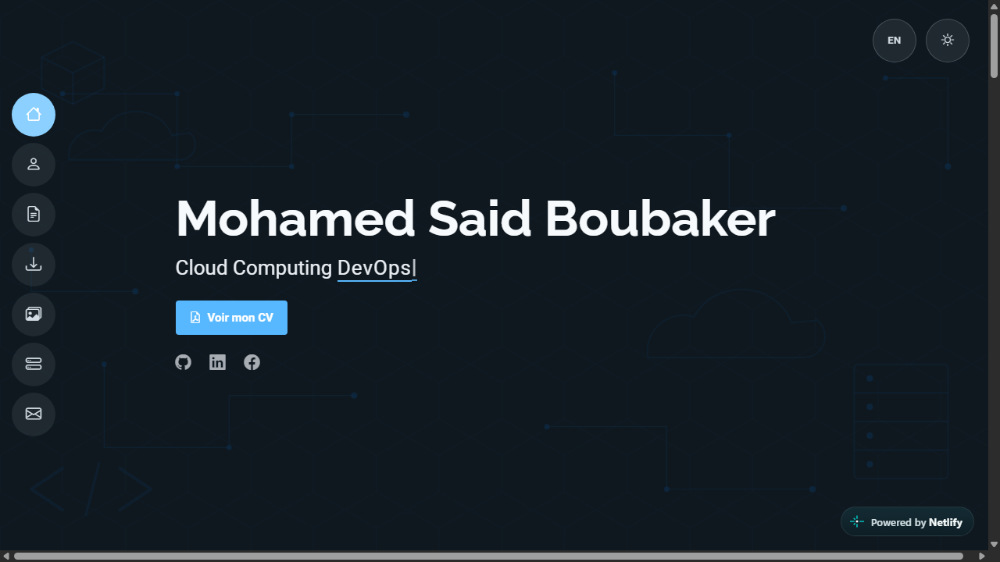

<div align="center">



# Mohamed Said Boubaker — Portfolio

Cloud Computing & DevOps engineering student · Full-Stack developer

[](https://dashing-pegasus-9aff6c.netlify.app/)


</div>

## About

This is my personal portfolio, showcasing my academic and professional projects in **web development**, **Cloud Computing** and **DevOps**. It's a fully static site (no backend required) built with plain HTML, CSS and vanilla JavaScript, deployed on Netlify.

**[→ View the live site](https://dashing-pegasus-9aff6c.netlify.app/)**

## Features

- 🌗 **Dark / light mode** toggle, with the choice remembered between visits
- 🌍 **French / English** language switcher, covering every page
- 📬 **Working contact form** (no backend) via [Formspree](https://formspree.io/)
- 🖱️ **Auto-scrolling project showcase** with category filters (Applications / Backend / Web & Cloud)
- 📄 **Dedicated detail pages** for each project, with screenshots, tech stack and contribution breakdown
- 📱 Fully **responsive** across desktop, tablet and mobile

## Tech stack

- **Core:** HTML5, CSS3 (custom properties for theming), vanilla JavaScript
- **UI:** [Bootstrap 5](https://getbootstrap.com/), [Bootstrap Icons](https://icons.getbootstrap.com/), [devicon](https://devicon.dev/)
- **Libraries:** [AOS](https://michalsnik.github.io/aos/) (scroll animations), [GLightbox](https://biati-digital.github.io/glightbox/), [Typed.js](https://github.com/mattboldt/typed.js/), [PureCounter](https://github.com/srexi/purecounterjs), [Waypoints](http://imakewebthings.com/waypoints/)
- **Forms:** [Formspree](https://formspree.io/) (static form backend)
- **Hosting:** [Netlify](https://www.netlify.com/)

## Projects

| Project | Description | Stack |
|---|---|---|
| **[BeforeItGoes](https://dashing-pegasus-9aff6c.netlify.app/beforeitgoes.html)** | Anti food-waste SaaS marketplace, deployed on a private OpenStack cloud | Spring Boot · Angular · FastAPI · Docker · Kubernetes |
| **[OMARISE e-learning platform](https://dashing-pegasus-9aff6c.netlify.app/omarise.html)** | Microservices-based online learning platform built during an internship | Spring Boot · Spring Cloud · Angular · MongoDB · RabbitMQ |
| **[Anomaly Detection](https://dashing-pegasus-9aff6c.netlify.app/detection-anomalies.html)** | REST API detecting fraudulent transactions with unsupervised ML models | Python · FastAPI · Scikit-learn · MySQL |
| **[Leavemetry](https://dashing-pegasus-9aff6c.netlify.app/leavemetry.html)** | HR web app for leave request management | MongoDB · Express.js · React · Node.js |
| **[SahaTeck](https://dashing-pegasus-9aff6c.netlify.app/sahatech.html)** | Web & desktop healthcare application for patient/doctor follow-up | Symfony · JavaFX · MySQL |

## Running locally

This is a static site with no build step or dependencies — just open it in a browser:

```bash
git clone https://github.com/Sa3id-Boubaker/Portfolio-Sa3id.git
cd Portfolio-Sa3id
git checkout portfolio
```

Then open `index.html` directly in your browser, or serve the folder with any static server, e.g.:

```bash
npx serve .
```

> The site's source code lives on the [`portfolio`](https://github.com/Sa3id-Boubaker/Portfolio-Sa3id/tree/portfolio) branch.

## Contact

- **Email:** MohamedSaid.Boubaker@esprit.tn
- **LinkedIn:** [mohamed-said-boubaker](https://linkedin.com/in/mohamed-said-boubaker-847859229/)
- **GitHub:** [@Sa3id-Boubaker](https://github.com/Sa3id-Boubaker)
